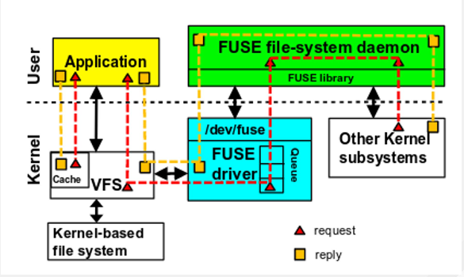

# DNAnexus storage as a filesystem

### Motivation

Bioinformatics tools, by and large, assume a Unix environment and a POSIX filesystem. This allows bash scripts and python code to run without error.

### Goal

Mount the DNAnexus storage system as a POSIX filesystem.

### Challenge

The DNAnexus storage system is not POSIX. Here are some important differences:

1. Several files in the same directory can have the same name. This allows multiple versions of a file to be kept.
2. A filename can include slashes
3. A file and a directory may have the same name
4. The storage system holds not just files and directories, but also records, databases, applets and workflows.
5. Hard links are not allowed in a project, but are allowed between projects.
6. File locking is not supported
7. Files are immutable, consistency between multiple writers is non standard
8. Directories don't have atime, mtime, ctime, and size.
9. Files don't have atime.
The big question is how to bridge these gaps, presenting a regular filesystem to an application. One possible approach is to mount the object system as a network filesystem, something equivalent to [Amazon EFS](https://aws.amazon.com/efs/). An alternative is to write a FUSE filesystem on the cloud workers, similar to [Google Cloud FUSE](https://cloud.google.com/storage/docs/gcs-fuse), or [S3 FUSE](https://github.com/s3fs-fuse/s3fs-fuse).

An additional approach is using a client side kernel module. The main benefit is less memory copying, compared to FUSE. However, development and debugging are much more difficult because it is done in kernel space; errors cause the kernel to crash, taking down the entire machine. This direction has been on the decline in recent years, which is why we only mention it in passing.

### Network filesystem

Linux supports many network filesystems. For example, [NFS](https://en.wikipedia.org/wiki/Network_File_System), that mounts a remote filesystem on a local machine; the approach taken by Amazon EFS. The benefit of using an established protocol is that Linux already has a high quality kernel client for it, and the protocol has been well thought out. The task is to write a server for it, that will bridge the POSIX mismatches, and will be high performance.

Such a server needs to maintain metadata database, to translate between DNAx file names, and POSIX file names. For example, it needs to give two versions of a file, different names, and record this on stable storage. It also needs to efficiently translate file IO requests to S3 requests. This does not look like an easy task, in addition, we will have to deploy and maintain a set of large file-servers on the DNAx side.

DNAx users have become use very fast streaming, for example, using `dx cat`. With a server side filesystem, we have no way to do large readahead, beyond the 128KB the kernel does. Furthermore, detecting sequential access on the server is harder than on the client, because the NFS server does not receive open/close file requests.

### Worker FUSE

The Filesystem in Userspace [FUSE](https://en.wikipedia.org/wiki/Filesystem_in_Userspace) protocol allows a developer to write a filesystem in userspace, instead of the kernel. It enables using complex external tools such as databases, compilers, and debuggers. It is much safer than a kernel module, because a bug will not take down the entire machine. This come at the cost of performance, because many requests have to go through three context switches instead of one. In addition, IO requests incur more memory copying. Nevertheless, FUSE has become popular, because system complexity has been rapidly increasing, making a kernel implementation more difficult. It is especially popular for exporting cloud storage systems.

​								*Image taken from* [Experiences with FUSE in the Real World](https://www.usenix.org/sites/default/files/conference/protected-files/vault19_slides_pillai.pdf)

Writing a prototype in the [go](https://golang.org/) programming language took approximately a month to write. In terms of performance, it is 25% slower than `dx cat` when streaming 1GiB file.
